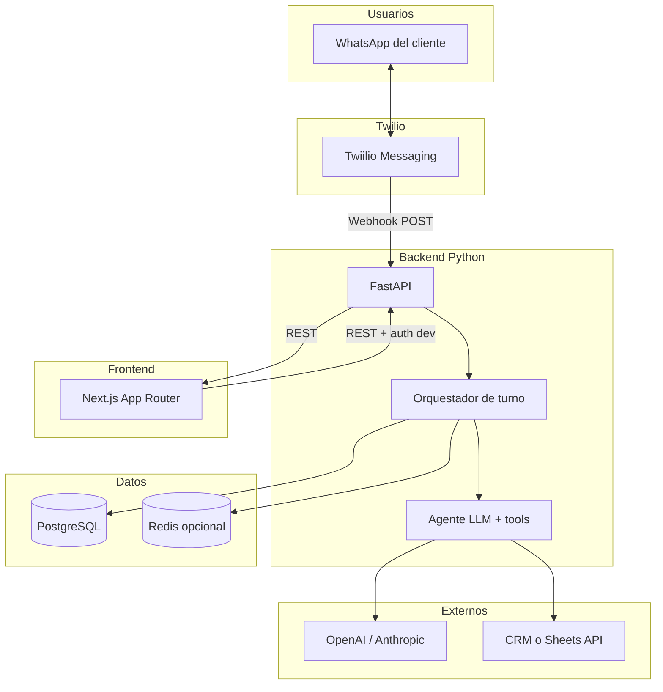

# Plan: WhatsApp Agent (Twilio) + Backend + Next.js

Documento maestro del proyecto: arquitectura, fases, Twilio, agente con herramientas, datos y frontend Next.js para pruebas y operación básica.

---

## 1. Objetivo del producto

Construir un **backend agentico** que:

1. Recibe mensajes entrantes de **WhatsApp vía Twilio**.
2. Mantiene **estado y contexto** por conversación (thread por `From` / `ConversationSid` según modelo Twilio).
3. Invoca un **LLM con tool calling** para decidir respuestas y acciones.
4. Ejecuta **acciones reales** (crear/actualizar leads, consultas, escalamiento humano).
5. Responde al usuario por el mismo canal Twilio.

Una app **Next.js** sirve para **probar el flujo de punta a punta** (simular o inspeccionar), **ver conversaciones**, **disparar pruebas** y **configuración de desarrollo**; en producción el canal principal sigue siendo WhatsApp.

---

## 2. Alcance y no-alcance

### En alcance (MVP)

- Webhook Twilio (POST) verificado con firma o validación Twilio (según entorno).
- Envío de respuestas Twilio (TwiML / Messages API según implementación elegida).
- Persistencia PostgreSQL: mensajes, conversaciones, leads, invocaciones de tools.
- Agente con tools tipadas + salida estructurada opcional para calificación.
- Frontend Next.js: listado de conversaciones, detalle de mensajes, estado del lead, botón “escalar a humano” (llamada a API), página de salud / docs internas.
- Docker Compose: API + DB (+ Redis opcional).

### Fuera de alcance (inicial)

- Multi-tenant complejo con facturación (se deja preparado el modelo `tenant_id` si aplica).
- App móvil nativa.
- Integración CRM profunda (solo capa abstracta + un adaptador, p. ej. HubSpot o Google Sheets).

---

## 3. Arquitectura general



**Flujo resumido (mensaje entrante)**

1. Twilio envía POST al endpoint público del backend (`/webhooks/twilio/whatsapp`).
2. FastAPI valida la petición (firma Twilio en prod).
3. Se resuelve `conversation_id` interno a partir de `From` (E.164) y opcionalmente `AccountSid` / subcuenta.
4. Se persiste el mensaje entrante (idempotencia por `MessageSid` de Twilio).
5. El orquestador arma el historial reciente, llama al LLM con tools.
6. Se ejecutan tools aprobadas (escritura con validación), se persisten resultados y mensajes salientes.
7. Respuesta a Twilio: TwiML con `<Message>` o respuesta JSON según el tipo de webhook configurado (documentar una sola convención en el repo).

**Frontend Next.js**

- Consume la **misma API** en rutas como `/api/internal/...` (BFF) o directamente al FastAPI con CORS restringido a tu dominio en dev.
- En desarrollo: túnel (ngrok, Cloudflare Tunnel) ya apunta a FastAPI para Twilio; Next puede correr en `localhost:3000` y llamar a `localhost:8000`.

---

## 4. Twilio (WhatsApp)

### 4.1 Prerrequisitos

- Cuenta Twilio y número habilitado para **WhatsApp Sandbox** (dev) o **WhatsApp Business** aprobado (prod).
- URL del webhook **HTTPS** accesible desde internet (túnel en dev).

### 4.2 Configuración en consola Twilio

| Concepto | Uso en el plan |
|----------|----------------|
| **WhatsApp Sandbox** | Palabra clave para unirse; ideal para MVP y demos. |
| **Webhook “When a message comes in”** | URL `POST` → FastAPI `/webhooks/twilio/whatsapp`. |
| **HTTP method** | POST (recomendado). |
| **Status callback** (opcional) | Entregas/leído; útil para métricas y reintentos. |

### 4.3 Campos relevantes del webhook (referencia)

A nivel de plan, el backend debe parsear y guardar como mínimo:

- `MessageSid`: idempotencia y trazabilidad.
- `From`, `To`: identificación del chat (normalmente `whatsapp:+521...`).
- `Body`: texto del usuario (si vacío, considerar media en fase 2).
- `NumMedia` / URLs de media: fase 2 (descarga con auth Twilio).
- `AccountSid`: multi-cuenta o auditoría.

### 4.4 Seguridad

- Validar **firma de Twilio** (`X-Twilio-Signature`) comparando con el body y la URL canónica del webhook (documentar la URL exacta registrada en Twilio para evitar discrepancias).
- En sandbox, mantener la misma validación para acostumbrar el código a prod.

### 4.5 Respuestas al usuario

- Opción A: responder en el mismo ciclo del webhook con **TwiML** (`<Response><Message>...</Message></Response>`), simple para MVP con respuestas cortas.
- Opción B: responder **202** rápido y enviar mensaje vía **Twilio REST API** desde un worker (mejor para LLMs lentos o múltiples mensajes); Twilio puede reintentar el webhook si el timeout se excede — documentar límites y elegir A o B explícitamente en implementación.

**Recomendación para el plan**: MVP con **Opción A** si la latencia del LLM es aceptable (< ~10–15 s según políticas); migrar a **Opción B** con cola si crece.

---

## 5. Backend (FastAPI)

### 5.1 Módulos sugeridos

```
app/
  main.py                 # App, routers, middleware CORS
  config.py               # Settings pydantic-settings
  webhooks/
    twilio_whatsapp.py    # POST handler, validación firma
  services/
    conversation.py       # CRUD conversación + últimos N mensajes
    orchestrator.py       # Un turno: policies → LLM → tools → persist
    messaging.py          # Envío Twilio (TwiML o REST)
  agent/
    runner.py             # Bucle tool calls con límite de iteraciones
    tools/                # Definiciones + ejecutores
  models/                 # SQLAlchemy
  schemas/                # Pydantic request/response
  workers/                # Opcional: cola async
```

### 5.2 Endpoints REST (además del webhook)

| Método | Ruta | Propósito |
|--------|------|-----------|
| GET | `/health` | Liveness para Docker / balanceador. |
| GET | `/internal/conversations` | Lista paginada (Next.js). |
| GET | `/internal/conversations/{id}` | Detalle + mensajes. |
| POST | `/internal/conversations/{id}/handoff` | Marcar escalamiento + motivo. |
| POST | `/internal/dev/reply` | Solo dev: simular mensaje entrante (opcional, con API key). |

Proteger `/internal/*` con **API key** o JWT en header; en producción, restringir por IP/VPN si es interno.

### 5.3 Orquestador (un “turno”)

1. Cargar políticas (horario, idioma, max_tokens).
2. Construir mensajes para el LLM (system + historial truncado).
3. Llamar al proveedor con `tools` definidas.
4. Por cada `tool_call`: validar args → ejecutar → append `tool` result al contexto.
5. Mensaje final del asistente → guardar en DB → formatear respuesta Twilio.
6. Límite máximo de iteraciones de tools (p. ej. 5) para evitar bucles.

### 5.4 Tools (ejemplo MVP)

| Tool | Tipo | Descripción |
|------|------|-------------|
| `save_lead` | Escritura | Upsert lead con nombre, email, teléfono, notas, score. |
| `get_lead_by_phone` | Lectura | Consultar lead por teléfono normalizado. |
| `request_human_handoff` | Escritura | Marca conversación + notifica (email/Slack en fase 2). |
| `search_faq` | Lectura | Opcional: búsqueda en embeddings o tabla estática. |

Cada ejecución registra fila en `tool_invocations` (args redactados si hay secretos).

### 5.5 LLM

- Proveedor: OpenAI o Anthropic (abstraer con interfaz común).
- **Structured output** para un bloque final `LeadQualification` (Pydantic) además del mensaje al usuario, si el modelo lo soporta en la misma llamada o en una segunda llamada ligera.

---

## 6. Modelo de datos (PostgreSQL)

### 6.1 Tablas mínimas

- **conversations**: `id`, `twilio_from`, `twilio_to`, `status` (open, handed_off, closed), `created_at`, `updated_at`.
- **messages**: `id`, `conversation_id`, `direction` (inbound/outbound), `body`, `twilio_message_sid` (unique nullable), `raw_payload` (JSONB opcional, acotar tamaño), `created_at`.
- **leads**: `id`, `conversation_id`, `phone`, `email`, `name`, `qualification` (JSONB), `stage`, `updated_at`.
- **tool_invocations**: `id`, `conversation_id`, `tool_name`, `arguments`, `result`, `error`, `duration_ms`, `created_at`.
- **handoffs**: `id`, `conversation_id`, `reason`, `status`, `created_at`, `resolved_at`.

Índices: `messages(conversation_id, created_at)`, `leads(phone)`, unique `twilio_message_sid` donde aplique.

### 6.2 Idempotencia

- `INSERT` de mensaje inbound con `twilio_message_sid` único: conflicto → no reprocesar el turno completo (o solo ack a Twilio).

---

## 7. Frontend (Next.js)

### 7.1 Stack

- **Next.js 15** (App Router), TypeScript.
- **Tailwind CSS** para UI rápida y consistente.
- Fetch al FastAPI desde **Server Components** o **Route Handlers** (`app/api/...`) para no exponer la API key al navegador (recomendado).

### 7.2 Pantallas / rutas sugeridas

| Ruta | Función |
|------|---------|
| `/` | Dashboard: resumen + últimas conversaciones. |
| `/conversations` | Tabla con búsqueda y paginación. |
| `/conversations/[id]` | Timeline mensajes + panel lead + botón “Escalar”. |
| `/dev` (solo `NODE_ENV=development`) | Formulario para enviar payload simulado o texto de prueba al endpoint interno. |

### 7.3 Variables de entorno (Next)

- `BACKEND_URL` — URL del FastAPI.
- `INTERNAL_API_KEY` — misma clave que valida el backend en `/internal/*`.

### 7.4 CORS

- FastAPI: `allow_origins` solo `http://localhost:3000` en dev y el dominio de Vercel/propiedad en prod.

---

## 8. Repositorio monorepo (recomendado)

```
/
  apps/
    api/              # FastAPI (Python, pyproject.toml o requirements.txt)
    web/              # Next.js
  packages/
    shared-types/     # Opcional: JSON Schema / tipos TS generados desde OpenAPI
  docker-compose.yml
  PLAN_WHATSAPP_AGENT.md
```

Alternativa: dos repos (`wsp-agent-api`, `wsp-agent-web`) si el equipo lo prefiere; el plan es igual.

---

## 9. Docker

- **Servicio `api`**: imagen Python, uvicorn, puerto 8000.
- **Supabase**: Postgres gestionado (connection string Session pooler en `.env`).
- **Opcional `redis`**: cola/locks.
- **Servicio `web`**: build Next, puerto 3000, depende de `api` solo para orden de arranque.

Twilio en local: **no** va dentro de Docker para el túnel; el túnel apunta al host donde corre `api`.

---

## 10. Fases de implementación

### Fase 0 — Repositorio y estándares (1–2 días)

- Monorepo, linters (Ruff, ESLint), `.env.example` para `api` y `web`.
- OpenAPI automático desde FastAPI; opcional export a tipos TS.

### Fase 1 — Twilio webhook vivo (2–4 días)

- Endpoint POST, validación firma, persistencia inbound, TwiML de respuesta fija (“Recibido, estamos procesando…”).
- Prueba con sandbox y número personal.

### Fase 2 — LLM + un tool (3–5 días)

- Integración OpenAI o Anthropic.
- Tool `save_lead` + persistencia; respuesta natural al usuario.
- Logs estructurados con `conversation_id`.

### Fase 3 — Orquestación completa y calificación (3–5 días)

- Múltiples tools, límite de iteraciones, structured qualification en JSONB.
- `get_lead_by_phone`, `request_human_handoff`.

### Fase 4 — Next.js (4–7 días)

- Lista y detalle de conversaciones vía Route Handlers proxy.
- Acción handoff desde UI.
- Página dev de prueba (opcional).

### Fase 5 — Endurecimiento (ongoing)

- Tests de integración webhook (fixtures Twilio).
- Rate limits, métricas básicas, backup DB.
- Decisión documentada: TwiML síncrono vs cola + REST async.

---

## 11. Variables de entorno (referencia)

**API**

- `DATABASE_URL`
- `TWILIO_ACCOUNT_SID`, `TWILIO_AUTH_TOKEN` (y si aplica `TWILIO_WHATSAPP_FROM`)
- `WEBHOOK_BASE_URL` (URL pública exacta para validar firma)
- `OPENAI_API_KEY` o `ANTHROPIC_API_KEY`
- `INTERNAL_API_KEY`
- `LOG_LEVEL`

**Web**

- `BACKEND_URL`
- `INTERNAL_API_KEY`

---

## 12. Riesgos y mitigaciones (Twilio + agente)

| Riesgo | Mitigación |
|--------|------------|
| Timeout del webhook con LLM lento | Opción B (ack + REST) o modelo más rápido / streaming interno sin bloquear Twilio. |
| Firma inválida por URL distinta | Una sola URL documentada; mismo path en túnel y prod. |
| Mensajes duplicados (reintentos Twilio) | Idempotencia por `MessageSid`. |
| Coste LLM | Truncar historial, modelo barato para clasificación, caché de FAQs. |

---

## 13. Criterios de “listo para demo”

- [ ] Mensaje de WhatsApp (sandbox) llega al webhook y se ve en PostgreSQL.
- [ ] El agente responde con texto coherente y puede guardar un lead vía tool.
- [ ] Next.js muestra la conversación y el lead actualizado.
- [ ] Handoff marca la conversación y queda visible en la UI.
- [ ] README con pasos: Twilio, túnel, `docker compose up`, variables.

---

## 14. Próximo paso inmediato

1. Crear monorepo `apps/api` + `apps/web` + `docker-compose.yml`.
2. Implementar Fase 1 (webhook Twilio + DB + respuesta TwiML).
3. Conectar Next a `/internal/conversations` con API key.

Este documento es la referencia viva del proyecto; al cerrar cada fase, actualizar checkboxes y decisiones (TwiML vs async) en la sección correspondiente.
