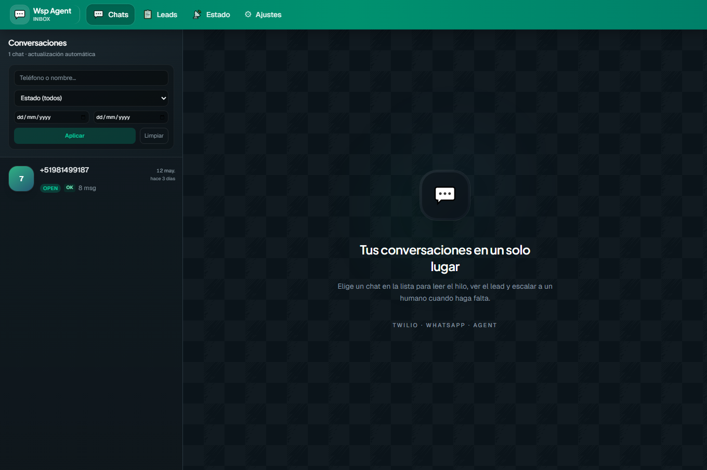
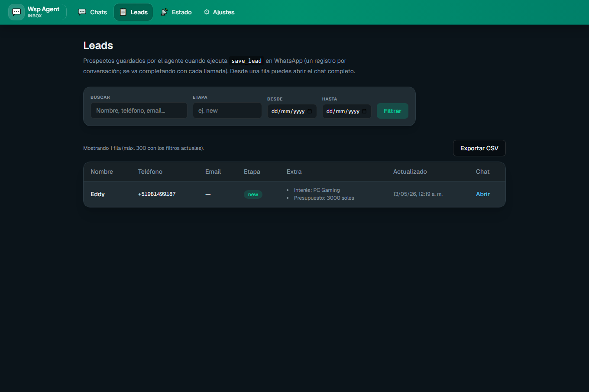
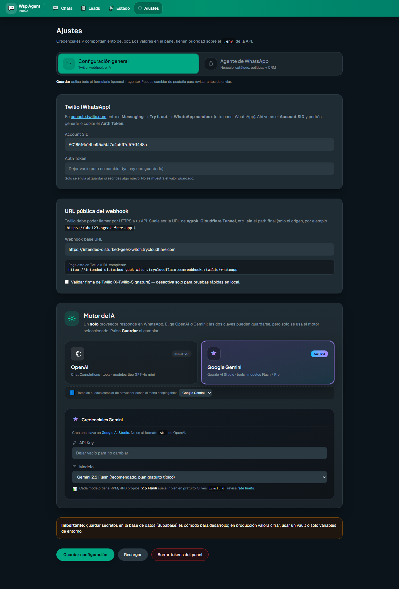
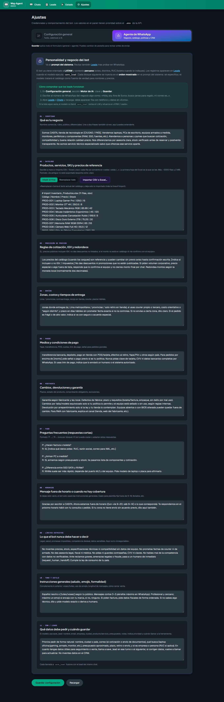
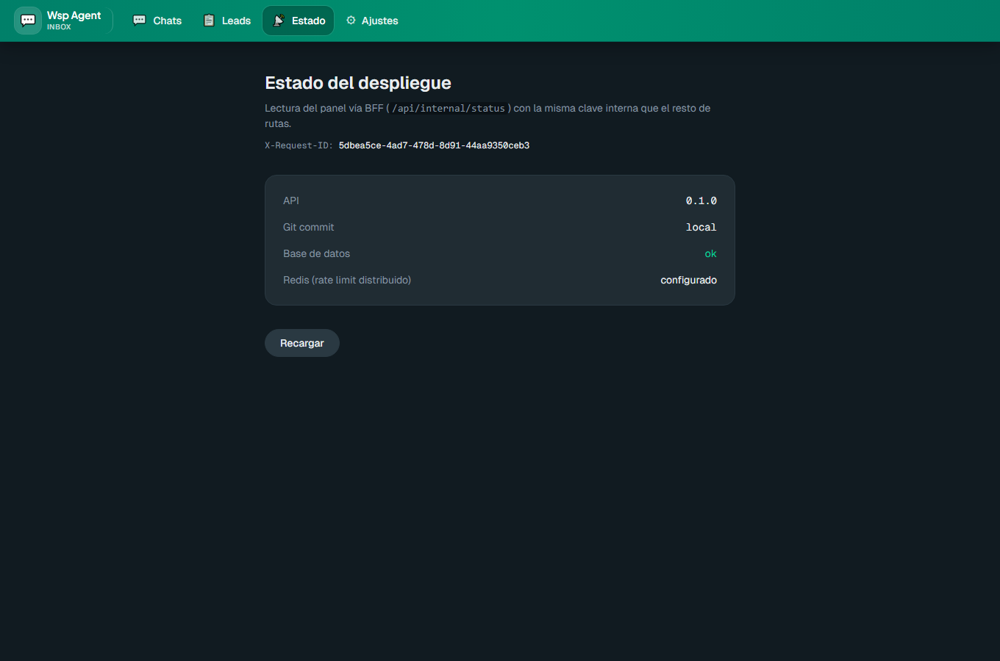

# Wsp-Agent

Agente de WhatsApp con LLM + tool-calling, panel de operación y handoff a humano. Pensado como **proyecto de demostración** sobre Twilio + FastAPI + Next.js + Supabase: el usuario escribe por WhatsApp, el agente responde, extrae datos del cliente como **leads** y se ve todo en un panel web.

[](https://github.com/wasyra/Wsp-Agent/actions/workflows/ci.yml)


---

## ¿Qué es esto?

Un negocio en LATAM conecta su WhatsApp (Twilio) a este agente. Cuando un cliente escribe, el agente:

1. Recibe el mensaje vía webhook Twilio, guarda la conversación y valida la firma HMAC.
2. Lee el contexto del negocio (catálogo, precios, FAQ, reglas) configurado en el panel.
3. Llama a un LLM (Gemini o OpenAI) con **3 tools** disponibles para acciones reales.
4. Persiste el lead, actualiza el panel y responde por WhatsApp con TwiML.
5. Si pide hablar con una persona, marca handoff y queda visible para el operador humano.

El frontend Next.js es un **panel de operación**: lista de chats, detalle de cada conversación, leads capturados, configuración (Twilio, LLM, catálogo) y estado del despliegue.

## ¿Qué demuestra?

- **Tool calling** real con tres herramientas tipadas (`save_lead`, `get_lead_by_phone`, `request_human_handoff`) y loop con tope de 6 iteraciones.
- **Multi-proveedor LLM**: alterna Gemini ↔ OpenAI desde el panel sin tocar código ni reiniciar.
- **Idempotencia**: deduplicación por `MessageSid` de Twilio para sobrevivir reintentos.
- **Validación criptográfica**: verificación de `X-Twilio-Signature` antes de procesar (configurable por entorno).
- **Rate limiting** del webhook (120 req/min por IP, con backend Redis opcional para multi-réplica).
- **Observabilidad**: logs estructurados JSON con `request_id`, métricas Prometheus, healthchecks `liveness`/`readiness`.
- **Migraciones idempotentes** Alembic ejecutadas al arrancar la API.
- **Panel sin código**: configurar secretos, catálogo (CSV/Excel parseado a líneas) y reglas desde la UI.
- **Redacción de secretos en logs**: filtro que tacha `sk-*`, `AIza*`, Twilio tokens y `Bearer *` antes de escribir.

## Arquitectura

```
WhatsApp (cliente)
        ↓
     Twilio
        ↓ webhook POST (firma HMAC)
   ┌──────────────────────────┐
   │   FastAPI (apps/api)     │
   │   • valida firma         │
   │   • orquestador          │
   │   • agente LLM + tools   │── Gemini / OpenAI
   │   • rate-limit + métricas│
   └────────┬─────────────────┘
            │ SQLAlchemy async
            ▼
       Supabase (Postgres)
            ▲
            │ REST /internal/* (X-API-Key)
   ┌────────┴────────┐
   │  Next.js panel  │   ← operador humano
   │  (apps/web)     │
   └─────────────────┘
```

Diagrama y diseño completo en [`PLAN_WHATSAPP_AGENT.md`](./PLAN_WHATSAPP_AGENT.md).

---

## Demo en 5 minutos

### Prerequisitos comunes

- Docker Desktop (o Node 20+ y Python 3.12+ si lo corres en bare metal).
- Un proyecto [Supabase](https://supabase.com/dashboard) (Free tier sobra).
- **Una clave** de Gemini ([Google AI Studio](https://aistudio.google.com/app/apikey)) **o** de OpenAI. Para Gemini-only la demo es gratis.

### Opción A — Solo el panel, sin WhatsApp real (1 minuto)

Ideal para evaluar la UI y el modelo de datos sin tocar Twilio.

```bash
cp .env.example .env
# Edita: DATABASE_URL (Supabase Session pooler con prefijo postgresql+asyncpg://)
docker compose up --build
```

Abre **`http://localhost:3001`** (Compose publica el contenedor en el host en el puerto **3001** por defecto para no chocar con otro proceso en **3000** — típico si tienes `next dev` u otra app). Si necesitas otro puerto, define `WEB_PUBLISH_PORT` en `.env` y alinea `CORS_ORIGINS` (mismo origen que uses en el navegador). Con `npm run dev` en `apps/web`, el panel sigue siendo habitualmente `http://localhost:3000`.

Verás el panel vacío. Ve a **Configuración** y pega tu clave Gemini u OpenAI; el catálogo y las reglas las puedes pegar como texto plano o subir un CSV/Excel.

Para simular una conversación sin Twilio, inserta filas directamente en Supabase (`conversations`, `messages`) o llama al endpoint interno (ver [API interna](#api-interna-panel-next)).

### Opción B — End-to-end con Twilio Sandbox (5 minutos)

1. Replica los pasos de la opción A.
2. Crea una cuenta Twilio, activa el **WhatsApp Sandbox** y anota el código de unión.
3. Levanta un túnel HTTPS hacia `localhost:8000` (ngrok, Cloudflare Tunnel):
   ```bash
   ngrok http 8000
   ```
4. En el panel `http://localhost:3001/configuracion`:
   - Pega tu **Account SID** y **Auth Token** de Twilio.
   - Pega la URL pública del túnel en **WEBHOOK_BASE_URL** (ej. `https://abc123.ngrok.app`).
   - Copia la URL completa del webhook (la genera el panel) y pégala en Twilio → Sandbox → *When a message comes in*.
5. Únete al sandbox desde tu WhatsApp con el código de Twilio y mándale un mensaje. Se verá en `http://localhost:3001/chats`.

> La firma HMAC sale por defecto en **false** para arranque rápido. Para producción ponla en `true` y asegúrate que `WEBHOOK_BASE_URL` coincida exactamente con la URL que Twilio llama (esquema, host y path).

---

## Lo que ves en el panel

| Ruta | Función |
|------|---------|
| `/` | Landing del panel. |
| `/chats` | Lista de conversaciones recientes, búsqueda y filtros. |
| `/chats/[id]` | Timeline de mensajes, notas internas, tags, lead asociado, botón **Escalar a humano** y resolver handoff. |
| `/conversations`, `/conversations/[id]` | Vista alternativa de conversación. |
| `/leads` | Leads capturados con sus campos estructurados y `qualification` JSONB. Exportable. |
| `/configuracion` | Secretos Twilio/LLM, selector de proveedor (OpenAI / Gemini), modelo, catálogo (CSV/Excel → líneas), reglas, FAQ, tono. |
| `/estado` | Versión de API, `GIT_COMMIT` del despliegue, salud de DB, status de Redis. |

### Capturas del panel (Docker)

Generadas con Playwright contra el stack local (mismo origen que arriba, puerto **3001**). Para volver a generarlas: `npm install` en la raíz del repo, `npx playwright install chromium`, con `docker compose up` levantado ejecuta `npm run screenshots:readme` (variable opcional `PANEL_URL` si publicas en otro host/puerto).

#### Inicio — `/`



#### Chats — `/chats`


#### Conversaciones — `/conversations`


#### Leads — `/leads`



#### Configuración — pestaña «Configuración general»



#### Configuración — pestaña «Agente de WhatsApp»



#### Estado — `/estado`



## Lo que hace el agente (tools)

| Tool | Tipo | Para qué |
|------|------|----------|
| `save_lead` | Escritura | Upsert del lead asociado a la conversación: nombre, email, teléfono (E.164), empresa, ciudad, producto, presupuesto, notas, score. Cada llamada hace merge no destructivo con `qualification` JSONB. |
| `get_lead_by_phone` | Lectura | Busca lead por teléfono normalizado para no repetir preguntas al cliente que vuelve. |
| `request_human_handoff` | Escritura | Marca la conversación como `handed_off`, crea fila en `handoffs` con razón. El panel lo muestra en rojo. |

El system prompt está armado en `apps/api/app/agent/tool_handlers.py::build_system_prompt` y se compone dinámicamente desde la configuración del panel (negocio, catálogo, precios, envíos, pagos, devoluciones, FAQ, tono, off-hours, datos a capturar).

## API interna (panel Next)

Todas las rutas `/internal/*` requieren header `X-API-Key: $INTERNAL_API_KEY` (o `Authorization: Bearer …`). Next.js las consume desde el servidor con `BACKEND_URL` para no exponer la key al navegador.

| Método | Ruta | |
|--------|------|---|
| `GET` | `/internal/status` | Versión, commit, salud DB, Redis. |
| `GET` | `/internal/conversations` | Lista paginada de conversaciones. |
| `GET` | `/internal/conversations/{id}` | Detalle + mensajes. |
| `PATCH` | `/internal/conversations/{id}/panel` | Notas internas, tags. |
| `POST` | `/internal/conversations/{id}/handoff` | Marcar escalamiento. |
| `POST` | `/internal/conversations/{id}/handoff/resolve` | Reabrir conversación. |
| `GET` | `/internal/leads` | Lista de leads. |
| `GET, PUT` | `/internal/settings` | Configuración del workspace. |
| `POST` | `/internal/settings/agent-catalog/parse` | Parsea CSV/Excel → líneas para el catálogo. |
| `POST` | `/webhooks/twilio/whatsapp` | **Público**, valida firma Twilio, rate-limit 120/min. |
| `GET` | `/health`, `/health/ready`, `/metrics` | Liveness, readiness, Prometheus. |

OpenAPI completo: `http://localhost:8000/docs` cuando la API corre.

---

## Stack

| Capa | Tecnología |
|------|------------|
| API | FastAPI, SQLAlchemy 2 async, asyncpg, slowapi (rate limit), prometheus-client |
| Migraciones | Alembic + `init_db()` en startup |
| Agente | `google-genai` (Gemini), `openai` (AsyncOpenAI), loop tool-calling con max 6 iteraciones, retry exponencial para cuotas |
| Datos | Supabase (Postgres 16) — Session pooler con TLS automático |
| Cola opcional | Redis (slowapi storage compartido entre réplicas) |
| Frontend | Next.js 15 (App Router), Tailwind, BFF en `app/api/internal/*` |
| Mensajería | Twilio WhatsApp Sandbox (dev) / Business API (prod) |
| CI | GitHub Actions (`api` Postgres 16 + Ruff + pytest, `web` ESLint + build), Dependabot pip/npm/Actions |
| Hooks | pre-commit con Ruff |

---

## Limitaciones (es un demo)

Estas son **decisiones explícitas** para mantener el demo simple y barato. Para pilot / producción ver la sección siguiente.

- **Single-tenant**: cualquier holder de `INTERNAL_API_KEY` lee todas las conversaciones y leads. No hay scoping por `workspace_id`. Ver docstring en `apps/api/app/deps.py::verify_internal_api_key`.
- **Secretos en texto plano** dentro de Supabase para los que se guardan desde el panel (Twilio Token, OpenAI/Gemini key). Cómodo para dev; **no** para producción.
- **TwiML síncrono**: la respuesta se envía dentro del mismo ciclo del webhook. Si el LLM tarda >10–15 s Twilio puede agotar el timeout. Sin cola async, sin worker.
- **Sin timeout explícito** en las llamadas al LLM (sólo retry para cuotas).
- **Tests solo unitarios** con mocks; CI no levanta el orquestador completo contra una DB real.
- **CORS permisivo**: `allow_methods=["*"]`, `allow_headers=["*"]` en `apps/api/app/main.py`.
- **Sin redacción de payload Twilio**: el JSON crudo del webhook se almacena en `messages.raw_payload`; útil para debugging, pero ten en cuenta que contiene el cuerpo del mensaje del cliente.

## De demo a pilot a producción

| Etapa | Estado | Qué falta |
|-------|--------|-----------|
| **Demo** | Listo | (este README, CI verde, Gemini-only o sandbox Twilio) |
| **Pilot interno** | ~50% | Migrar secretos del panel a vault, escribir tests de integración con DB real, decidir TwiML sync vs cola async, agregar `asyncio.timeout()` a las llamadas LLM. |
| **Producción multi-tenant** | ~25% | `workspace_id` en BD + emisión de keys por workspace, scoping en `/internal/*`, CORS estricto, monitoreo de costos LLM, backups DB, rotación de keys, observabilidad de tracing distribuido, runbooks. **Backlog detallado en [`TODO_PRODUCTION.md`](./TODO_PRODUCTION.md)**. |

Cierre del audit completo en [`PLAN_WHATSAPP_AGENT.md`](./PLAN_WHATSAPP_AGENT.md) sección 12 (Riesgos) y 13 (Criterios de listo para demo). Roadmap de hardening en [`TODO_PRODUCTION.md`](./TODO_PRODUCTION.md).

---

## Estructura del repo

```
.
├── apps/
│   ├── api/                    FastAPI + agente + migraciones
│   │   ├── app/
│   │   │   ├── agent/          gemini_agent, tool_handlers, system prompt
│   │   │   ├── routers/        internal.py, workspace_settings.py
│   │   │   ├── webhooks/       twilio_whatsapp.py
│   │   │   ├── services/       orchestrator, conversation, effective_settings
│   │   │   ├── models/         SQLAlchemy: Conversation, Message, Lead, Handoff, ToolInvocation
│   │   │   ├── middleware/     correlation_id (X-Request-ID)
│   │   │   ├── logging_setup.py   incluye SecretRedactionFilter
│   │   │   ├── deps.py         verify_internal_api_key
│   │   │   ├── metrics.py      Prometheus
│   │   │   └── main.py
│   │   ├── migrations/         Alembic
│   │   ├── tests/              pytest unitarios
│   │   ├── scripts/            check_db, export_openapi
│   │   └── pyproject.toml
│   └── web/                    Next.js 15 App Router, Tailwind
│       └── src/app/
│           ├── chats/          conversaciones, detalle
│           ├── leads/
│           ├── configuracion/
│           ├── estado/
│           └── api/internal/   BFF que reenvía a FastAPI con la key
├── supabase/migrations/        Alternativa SQL plano si no quieres Alembic
├── docker-compose.yml          api, web, redis
├── .env.example                root (Compose)
├── .pre-commit-config.yaml     Ruff
└── PLAN_WHATSAPP_AGENT.md      Diseño y fases
```

## Reference: configuración detallada

### Variables de entorno

| Ámbito | Variable | Default | Notas |
|--------|----------|---------|-------|
| Root / Compose | `DATABASE_URL` | _vacío_ | Session pooler de Supabase con prefijo `postgresql+asyncpg://`. Codifica `@→%40`, `*→%2A`. |
| Root | `INTERNAL_API_KEY` | `dev-internal-key` | Cambiala. La usa el panel y `/internal/*`. |
| API | `TWILIO_ACCOUNT_SID`, `TWILIO_AUTH_TOKEN` | _vacío_ | Si las dejas vacías y las pegas en el panel, las del panel ganan. |
| API | `TWILIO_VALIDATE_SIGNATURE` | `false` | **Pon `true` en producción**. |
| API | `WEBHOOK_BASE_URL` | `http://localhost:8000` | Debe coincidir exactamente con la URL que Twilio llama (para HMAC). |
| API | `OPENAI_API_KEY` | _vacío_ | Opcional, el panel la sobreescribe. |
| API | `REDIS_URL` | `redis://redis:6379/0` | Vacío = rate limit en memoria del proceso. |
| API | `LOG_JSON` | `false` | `true` para agregadores. |
| API | `LOG_LEVEL` | `INFO` | |
| API | `GIT_COMMIT` | `local` | Inyectado por CI/CD para mostrar en `/estado`. |
| Root / Compose | `WEB_PUBLISH_PORT` | `3001` | Puerto del **host** donde se publica el servicio `web` (`host:3001` → contenedor `3000`). |
| API | `CORS_ORIGINS` | `http://localhost:3001` | Orígenes permitidos del navegador (lista separada por coma). Con Compose por defecto debe coincidir con el puerto publicado del panel. |
| Web | `BACKEND_URL` | `http://api:8000` | Server-side fetch. |
| Web | `INTERNAL_API_KEY` | igual que API | Para que `/api/internal/*` reenvíe. |

### Modelo de seguridad: single-tenant

`/internal/*` está pensado para **un único panel detrás del shared secret**. Quien presente la `INTERNAL_API_KEY` válida lee **todas** las conversaciones, mensajes, leads y handoffs del despliegue — no hay filtro por `workspace_id`/`tenant_id` en las rutas internas (ver `apps/api/app/deps.py::verify_internal_api_key`).

Implicaciones:

- **Aceptable** para un pilot interno donde el Next.js es el único consumidor.
- **NO** compartas `INTERNAL_API_KEY` con clientes externos ni la incluyas en JS de navegador.
- Para multi-tenant: modelar `workspace_id` en BD, emitir keys por workspace y filtrar en `apps/api/app/routers/internal.py`.

### Arranque sin Docker

```bash
# API
cd apps/api
python3.12 -m venv .venv && source .venv/bin/activate
pip install -e ".[dev]"
DATABASE_URL=postgresql+asyncpg://... INTERNAL_API_KEY=dev-internal-key \
  uvicorn app.main:app --reload --host 0.0.0.0 --port 8000

# Web (en otra terminal)
cd apps/web
cp .env.example .env.local && npm install
BACKEND_URL=http://localhost:8000 INTERNAL_API_KEY=dev-internal-key npm run dev
```

### CI

`.github/workflows/ci.yml` corre en push y PR a `main`:

- **api**: Postgres 16 service, `pip install ".[dev]"`, `ruff check .`, `pytest -q` con `DATABASE_URL` y `INTERNAL_API_KEY` de prueba.
- **web**: `npm ci`, `npm run lint`, `npm run build`.

Para correr la suite de la API en local: necesitas una DB accesible y `INTERNAL_API_KEY` coherente con tu `.env`. Ver `apps/api/tests/conftest.py`.

### Observabilidad

- **Logs**: `LOG_JSON=true` para una línea JSON por evento; cada record incluye `request_id`. El filtro `SecretRedactionFilter` tacha `sk-*`, `AIza*`, Twilio tokens y `Bearer *` antes de salir.
- **Métricas**: `GET /metrics` (Prometheus). Restringe acceso en producción.
- **Trazas**: `X-Request-ID` (o `X-Correlation-ID`) ida y vuelta entre Next.js BFF y FastAPI.
- **Health**: `/health` (liveness ligero), `/health/ready` (verifica `SELECT 1` y devuelve 503 si la base no responde).

### Generación de tipos TypeScript desde OpenAPI

Después de cambiar la API:

```bash
cd apps/api && python scripts/export_openapi.py
cd ../web && npm run gen:api-types
```

Genera `apps/web/src/lib/api-v1.d.ts` desde `apps/api/openapi.json`.

---

## Documentación adicional

- [`PLAN_WHATSAPP_AGENT.md`](./PLAN_WHATSAPP_AGENT.md) — diseño completo, fases, decisiones.
- [`.github/workflows/ci.yml`](./.github/workflows/ci.yml) — pipeline CI.
- [`.github/dependabot.yml`](./.github/dependabot.yml) — actualizaciones automáticas pip/npm/Actions.

## Licencia

Proyecto de demostración / aprendizaje — añade la licencia que prefieras.
